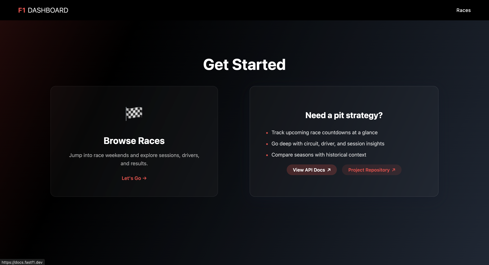
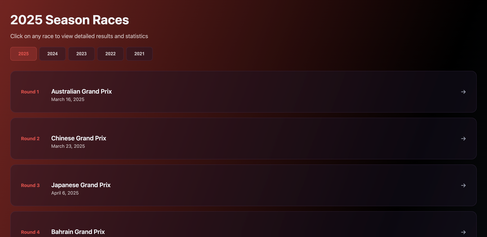
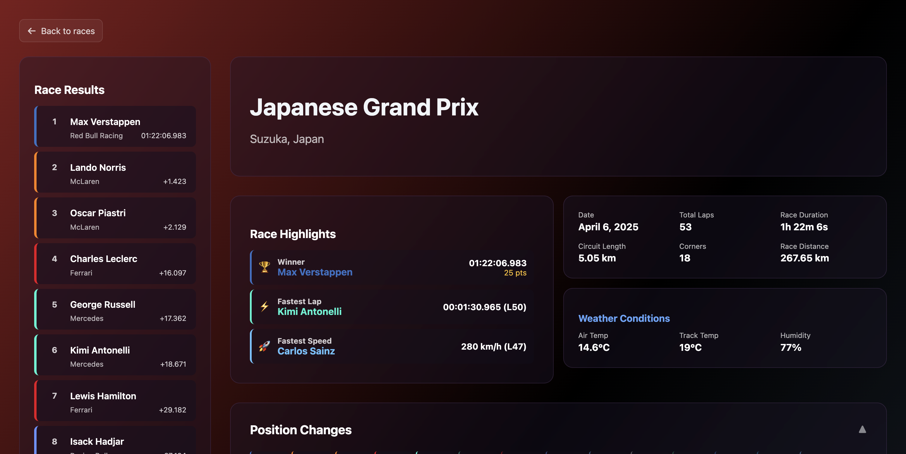
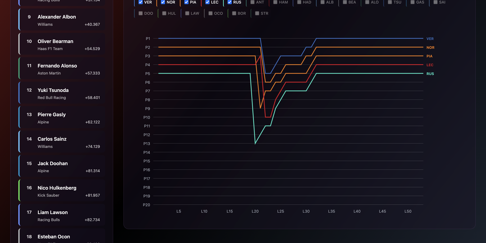

# F1 Project

Live demo: [https://f1-projekti.vercel.app/](https://f1-projekti.vercel.app/)\
_The backend may be paused between demos. If the site looks empty, please ping
me or start the backend locally (instructions below) and refresh so the FastF1
cache can warm up._



A Formula 1 data visualization application with Elm frontend and FastAPI
backend.

## Screenshots





## Quick Start

**Recommended:** Use the development script to start both servers:

```bash
./dev.sh
```

This will start:

- Backend API on http://127.0.0.1:8000
- Frontend on http://127.0.0.1:3001

## Manual Setup

### Backend (FastF1 + FastAPI)

```bash
cd backend
python3 -m venv venv
source venv/bin/activate
pip install -r requirements.txt
export ALLOWED_ORIGINS="http://localhost:5173"
# Optional but recommended for low-memory environments
export FASTF1_NO_CACHING=1
uvicorn app:app --host 127.0.0.1 --port 8000 --reload
```

To deploy on Fly.io:

```bash
cd backend
fly auth login
fly launch --name f1-backend-tarkiainen --copy-config --region ams --no-deploy
fly secrets set ALLOWED_ORIGINS="https://f1-projekti.vercel.app,http://localhost:5173"
fly secrets set FASTF1_NO_CACHING=1
fly deploy
```

### Frontend (Elm)

```bash
cd frontend
npm install
npm start
```

The development server will rebuild automatically on save and serve the app at
http://127.0.0.1:3001.

## API Endpoints

- `GET /next-race` – Latest event, countdown, and session schedule details
- `GET /races/{year}` – Overview list of races for the selected season
- `GET /race/{year}/{round}` – Detailed race metadata and results summary
- `GET /race/{year}/{round}/drivers` – Classified driver order with finishing
  stats
- `GET /race/{year}/{round}/positions` – Lap-by-lap position changes for each
  driver
- `GET /race/{year}/{round}/highlights` – Curated highlights, key moments, and
  context

## Upstream Data Availability

- The backend relies on FastF1’s aggregated schedule feeds (GitHub, the official
  F1 static API, and Ergast). If all upstream sources are unreachable the
  backend will return `503` for `/next-race`, and the frontend will display a
  “Live F1 schedule data is temporarily unavailable” message.
- These outages are external. No action is needed on the frontend—just wait for
  the upstream services to recover, then refresh. For persistent issues verify
  outbound connectivity from the deployment environment (Fly.io, local machine,
  etc.).

## Deployment & Security

- Set `ALLOWED_ORIGINS` (comma-separated) before starting the backend to
  restrict CORS. When developing locally the frontend should be accessed via
  `http://localhost:5173` (or `http://127.0.0.1:5173`) so it remains on the
  allow list.
  ```bash
  export ALLOWED_ORIGINS="https://f1-projekti.vercel.app,http://localhost:5173"
  ```
- When deploying to Vercel the provided `vercel.json` adds security headers
  (HSTS, X-Frame-Options, etc.). Adjust the file if you need additional policies
  such as a Content Security Policy.
- Keep backend credentials and API tokens out of the frontend bundle—store them
  as environment variables in Vercel or your hosting provider.
- The build script reads `API_BASE_URL` (defaults to `http://127.0.0.1:8000`).
  On Vercel set it to your deployed backend URL (e.g.
  `https://f1-backend-tarkiainen.fly.dev`) so `Config.elm` is generated with the
  correct endpoint.
- In constrained environments (e.g. Fly’s smaller machine classes) consider
  disabling FastF1 caching with `FASTF1_NO_CACHING=1` to avoid the backend
  exceeding its memory budget.

## Development

- Backend uses FastF1 with caching in `backend/f1_cache/`
- Frontend hot-reloads automatically when you save Elm files
- Use `./dev.sh` for the most stable development experience
